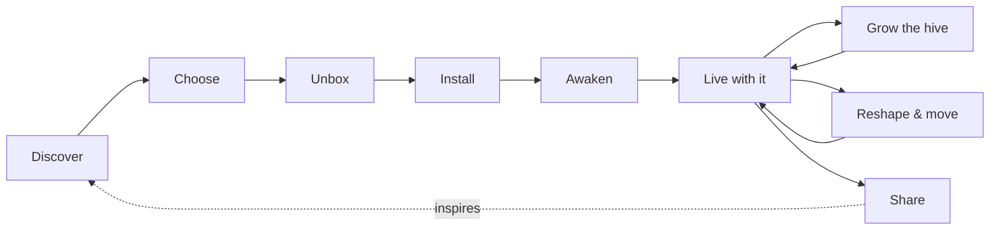

# Customer Experience

The end-to-end journey, described from the owner's point of view. This note covers **how it should feel and what must be true**, not how we build it.

---

## 1. Discover
**Moment:** Someone sees a hive at a friend's home, in a café, or on social media. It reads as wall art first, and then they realise it's alive.
**Feeling:** *"Wait, that's real? And it waters itself?"*
**What must be true:**
- The hive photographs beautifully, in real spaces and at every size from 3 cells to a full wall.
- The concept can be understood in one sentence and one image.

## 2. Choose
**Moment:** Deciding what to buy. Most people start with a **starter hive** (Heart + Brain + a few cells) and choose a plant palette or style.
**Feeling:** Excited and confident, never overwhelmed.
**What must be true:**
- Clear starting points: curated starter hives for each persona and style (e.g. *Fern Grove*, *Herb Kitchen*, *Desert Mosaic*, *Moss Study*).
- Owners can picture it on *their* wall at *their* scale before buying.
- It is obvious that they can start small and grow.

## 3. Unbox
**Moment:** The box arrives.
**Feeling:** Like unboxing a design object, not a kit of parts.
**What must be true:**
- Presentation worthy of a premium product.
- Plants (or plant-ready inserts) and the right growing medium arrive ready, so there's no bag of soil on the kitchen floor.
- What goes where is obvious at a glance.

## 4. Install
**Moment:** Putting the hive on the wall.
**Feeling:** *"That was easier than hanging a shelf."*
**What must be true:**
- One person, common household tools at most, within an hour.
- No plumber, no electrician, no permanent damage to the wall (renters matter).
- The layout is easy to plan and easy to change.

## 5. Awaken
**Moment:** Power on. The hive comes to life. It recognises each cell, learns or is told what's planted in each, and starts caring for them.
**Feeling:** Delight, the sense that the hive is *alive*.
**What must be true:**
- A short, satisfying first-run moment, possibly visible in the hive itself (a ripple of light across the cells as each is recognised).
- Sensible care starts immediately with no configuration. Configuration is optional.

## 6. Live with it
**Moment:** Day to day, week to week. This is most of the customer's life with the product.
**Feeling:** Calm. Mostly they just enjoy it.
**What must be true:**
- The hive handles watering, feeding and light on its own.
- Upkeep is rare, simple and predictable (e.g. a top-up or a nutrient refresh), and the hive tells you well before it's needed.
- Status can be read at a glance on the hive itself, with an app for depth rather than a requirement.
- Holidays are a non-event.
- **When things go wrong** (a plant struggling, a leak, a fault), the hive fails safe, tells the owner clearly, and says what to do.

## 7. Grow the hive
**Moment:** Adding cells. This is the signature moment of the product.
**Feeling:** *Click.* It just joined. Like adding a piece to a puzzle that keeps getting better.
**What must be true:**
- A new cell connects physically, to water, and to the Brain simply by being placed.
- The hive acknowledges the new member and folds it into care immediately.
- Owners are inspired to expand: new plant palettes, new cell types, seasonal ideas.

## 8. Reshape & move
**Moment:** Rearranging the composition, swapping plants for the season, or moving house.
**Feeling:** Flexible. The hive belongs to the owner and adapts to their life.
**What must be true:**
- Cells can be rearranged and the hive re-learns its shape.
- Replanting a cell is clean and easy.
- The whole hive can come down and go up again without drama.

## 9. Share
**Moment:** Showing it off, sharing a layout or a growing recipe, inspiring the next person.
**Feeling:** Pride and belonging.
**What must be true:**
- Hives are personal and worth photographing.
- There's a place to share layouts, plant pairings and (for the obsessed) recipes and data.

---

## Experience by persona (summary)
| Stage | 🌿 Casual | 🌱 Hobbyist | 🔬 Obsessed | 🖼️ Aesthete |
|---|---|---|---|---|
| Choose | Curated starter hive | Pick own plants | Pick hardware, plan experiments | Choose finish, palette, layout |
| Awaken | Fully automatic | Confirms plant types | Configures recipes | Admires the light-up moment |
| Live | Ignores it happily | Checks insights weekly | Dashboards, automations | Enjoys the object |
| Grow | Occasional cell | Steady expansion | Custom/experimental cells | Expands the composition |

## Open questions
- Is an app required, optional, or absent for the Casual owner?
- How visible should status be on the hive itself (light, colour, nothing)?
- Live plants shipped, plant-ready inserts, or bring-your-own plants? See [[Open Questions]].

## Related
[[Personas]] · [[System Concept]] · [[Design Principles]]
