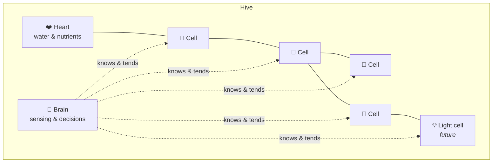

# System Concept

What the hive *does* and how its parts relate, **from the owner's point of view**. This is deliberately not an engineering design (see [[Engineering Overview]] for that).

## Anatomy of a hive

Cells connect to their neighbours, and through them the whole hive shares water, power and intelligence.

## Cell types (vision)
| Cell | Role | Launch? |
|---|---|---|
| **Planter cell** | Holds one planting in the right growing medium; is watered, fed and sensed individually | Core |
| **Heart** | Holds or connects the water and nutrient supply and moves it through the hive | Core |
| **Brain** | Senses, decides, coordinates; the owner's point of contact | Core *(may share a body with the Heart — open question)* |
| **Light cell** | Grow and ambient light for darker walls | Maybe |
| **Reservoir cell** | Extends how long the hive runs between top-ups | Maybe |
| **Blank / art cell** | Pure composition: wood, stone, mirror, moss | Maybe |
| **Feature cells** | Display, water feature, speaker... | Horizon |

## What the hive does
1. **Waters** each cell according to what's planted in it and how it's doing.
2. **Feeds** with nutrients matched to the plants.
3. **Senses** moisture and, as needed, light, temperature, humidity and reservoir level.
4. **Lights** plants where ambient light is insufficient, and can double as ambient or accent light.
5. **Adopts** new cells automatically and learns the hive's shape.
6. **Protects** the home: it detects leaks or faults and fails safe.
7. **Reports** status at a glance, with alerts only when needed and detail on demand.

## Levels of autonomy
| Mode | For | Behaviour |
|---|---|---|
| **Autopilot** | 🌿 Casual, 🖼️ Aesthete | Everything automatic from sensible defaults |
| **Guided** | 🌱 Hobbyist | Plant-specific profiles, suggestions and insights; owner approves changes |
| **Expert** | 🔬 Obsessed | Per-cell schedules and recipes, raw data, integrations, overrides |

Modes are a *dial*, not separate products. An owner can move freely between them.

## Care profiles
Each planter cell has a **care profile** describing how its plant likes to live: thirst, feeding, light, and preferred growing medium. Profiles can be:
- chosen from a library (e.g. *Fern*, *Succulent*, *Basil*, *Pothos*)
- inferred or tuned over time by the Brain
- written from scratch by experts and shared with the community

## Related
[[Vision]] · [[Glossary]] · [[Customer Experience]]
